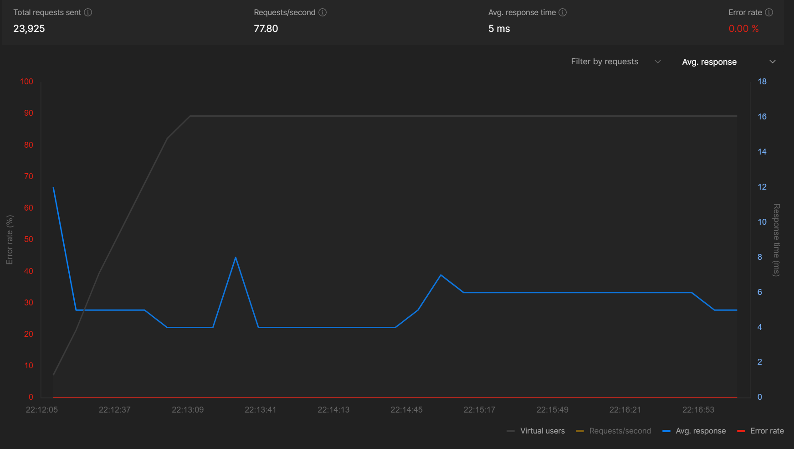
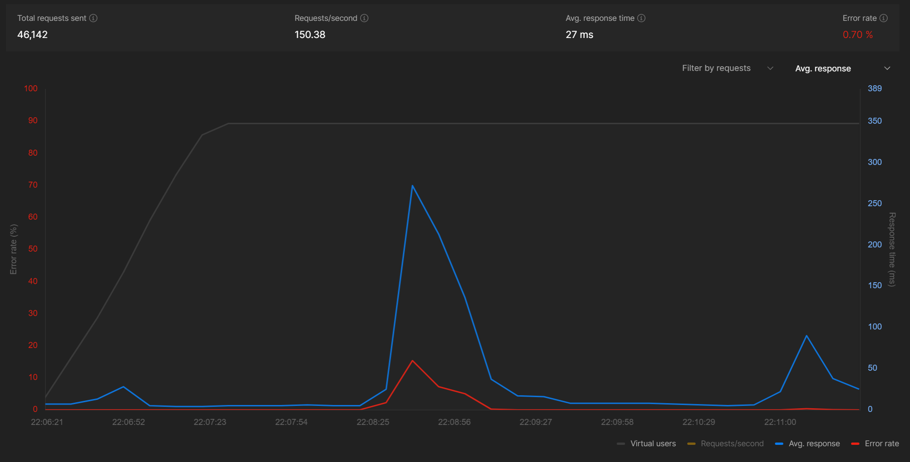
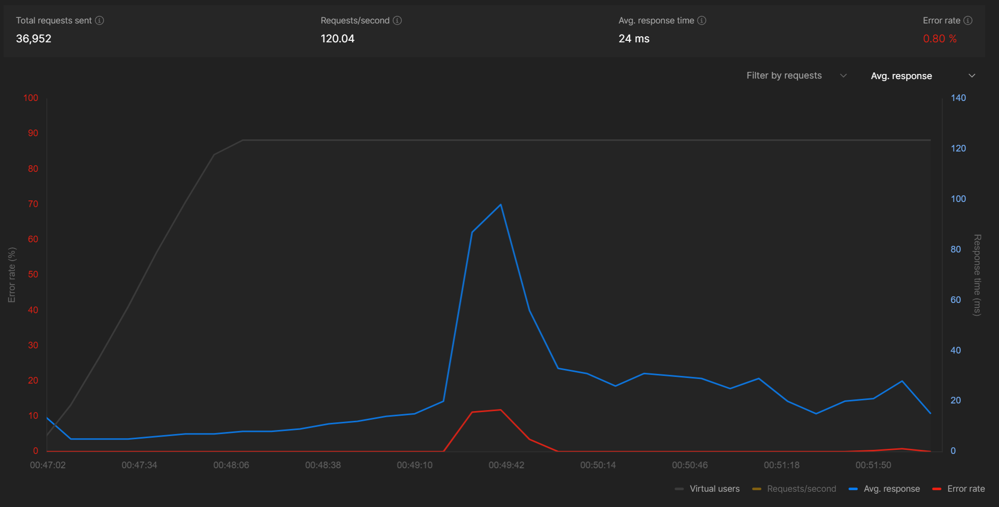
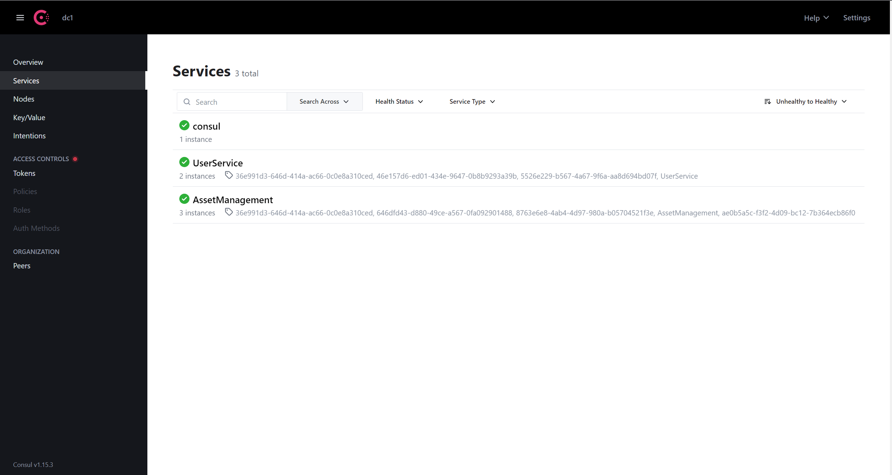

This is the repository for the ByteDance and Tiktok Orbital 2023.

## About

This is the MVP project for our API Gateway based on one Hertz server and multiple RPC servers.

The API Gateway, which is a Hertz server, listens to requests at port 4200 on multiple exposed endpoints "/{serviceName}/{path}" [POST] and "/{serviceName}/{serviceMethod}" [GET]. Once it receives an API request, it then forwards the request to the Kitex server (by Kitex generic call). The user service is at port 8888 while the Asset Management service can be initialised on any port from user input from console.

### Components and features of MVP:

1. API Gateway Server: The API Gateway is implemented as a Hertz server that listens to requests on port 4200. It exposes multiple endpoints in the format `/{serviceName}/{path}` for both POST and GET requests. The API Gateway acts as an intermediary between user requests and the Kitex RPC servers.

2. RPC Server Integration: The API Gateway forwards incoming API requests to the Kitex server using the internal RPC client within the Hertz server. It enables communication between the client and the respective RPC servers responsible for handling specific services.

3. Service Registration: Although the registration functionality is not yet integrated with the service registry, service information can be sent to the `:/register` endpoint in JSON format. The JSON payload includes service details such as the service name, address, port, and additional metadata like service description, version, and IDL content.

4. Automated connection: Services can automate their connection at the `:/connect` endpoint of the API Gateway using an API Key.

5. Health Declaration: Servers connected to the API Gateway need to declare their health by making periodic requests to the `:/health` endpoint at least every 10 seconds. This ensures that the API Gateway considers the servers healthy and forwards requests to them. If a server fails to declare its health for 1 minute, it is delisted from the system and needs to reconnect.

6. Load Balancing: The MVP version implements round-robin load balancing, distributing the requests equally among the connected RPC servers. This helps achieve better scalability and performance by effectively utilizing the available server resources. Future updates will include weighted round-robin load balancing for improved efficiency.

## Performance

On Load testing with Postman, we were able to have the following benchmarks:
The lower the blue line is, the better.
The red line indicates rate.


2 instances of User Service and 3 instances of Asset Management Service

- Users : 25
- Total time : 5 mins
- Ramp up time: 1 min


2 instances of User Service and 3 instances of Asset Management Service

- Users : 50
- Total time : 5 mins
- Ramp up time: 1 min

Despite the spike in between the server showed great recovery.


3 instances of User Service and 3 instances of Asset Management Service

- Users : 30
- Total time : 5 mins
- Ramp up time: 1 min

Again, after the spike, the showed great recovery.

### Registration :

For now, the registration functionality is NOT integrated with the service registry. However, service information for registration can be sent at the (POST) `:/register` endpoint with the following json format which is accepted with our service registry Consul as well :

```
[
  {
    "Service": {
      "Name": "first-service",
      "Tags": [],
      "Address": "serviceName/path",
      "Port": 80,
      "Meta": {
        "serviceDescription": "Service for managing assets",
        "serviceVersion": "1.0",
        "idl":"idlcontent" (Required)
      },
      "Check": {
        "HTTP": "http://serviceAddress/service/myservice/1/health",
        "Interval": "10s"
      }
    }
  }
]
```

The `"idl":"idlcontent"` field is required as require the IDL content to make the RPC calls from the gateway to the service.

Later, we will connect the registration with our registry and IDL mappings.

Moreover, to see all registered service we can hit the endpoint `:/show`. (This will be removed later and was made just for testing purposes)

## Connecting services to the gateway:

Ensure that your servers can perform all the methods indicated in your interface definition during service registry.

- Register your servers via the `:/connect` endpoint each time a new server is booted up. Use the `server_utils.go` file for the methods which can be used in the service to connect to the gateway. Examples are present in the `main.go` of the services.
- Declare your servers as healthy to our system by making requests to the `:/health` endpoint at least every 10 seconds.

To connect your server to our system, follow these steps:

1. Register your service and receive an API Key.
2. On server bootup, send a request to `:/connect` with the API Key, service details, server address, and port.
3. Get a serverID upon successful connection.
4. Declare your server's health by regularly sending requests to `:/health` with the API Key and serverID.
   Remember:

Note:

- New servers should register themselves via :/connect.
- Servers must declare themselves healthy every 10 seconds.
- Servers are delisted if they don't declare health for 1 minute.
- If delisted, reconnect..

Load balancing currently uses round-robin, but will be upgraded to weighted round-robin.

For the detailed guide on service connection, check out [Server Connection Guide](ServerConnectionGuide.md)

## How to use? [^3]

**Step 1:**

Initialise the Hertz Server using the command: `go run .` from the respective directory

To check if the server is running, hit the following GET endpoint
`"http://localhost:4200/ping"`

It should reply with the message :

```
{
    "message": "pong"
}
```

**Step 2:**

Start consul agent using `consul agent -dev`. (Consul needs to be installed for this)
The consul GUI can be accessed at `http://localhost:8500`

**Step 3:**

Initialise multiple Kitex Services from their respective directories by using the command `go run .`
There can be multiple instances for a service. The service would automatically detect a free port and start the service on that free port locally.

Currently, we have the following functional services :

1. Asset Management

##### Public endpoints:

- (POST) `/AssetManagement/newAsset` which maps to the private "insertAsset" endpoint of the service
- (GET) `/AssetManagement/getAsset` which maps to the private "queryAsset" endpoint of the service

2. User Service

##### Public endpoints:

- (POST) `/UserService/newUser` which maps to the "insertUser" endpoint of the service
- (POST) ` / UserService/insertUser` which also maps to the same "insertUser" endpoint of the service
- (GET) `/AssetManagement/getUser` which maps to the private "queryUser" endpoint of the service

Once initialised they are automatically connected to consul, for example :



**Step 4:**

Send a POST or GET requests to the "/{serviceName}/{path}" endpoint, for example:

```
curl -X POST -H "Content-Type: application/json"
-d '{
  "ID": "2",
  "Name": "Google",
  "Market": "US"
}'
"http://localhost:4200/AssetManagement/newAsset"
```

Now try quering the info,

```
curl -X GET http://localhost:4200/AssetManagement/queryAsset?ID=2
```

- The "ID" should be capital as it's case sensitive.
