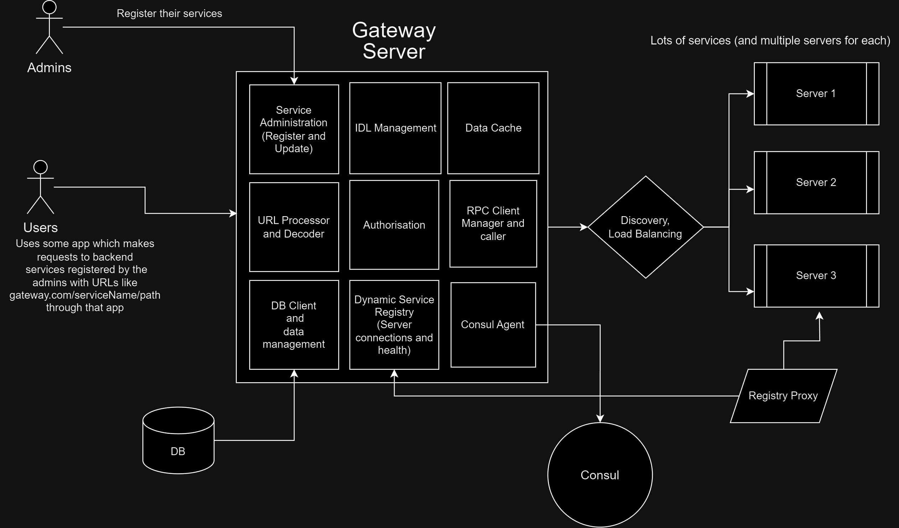
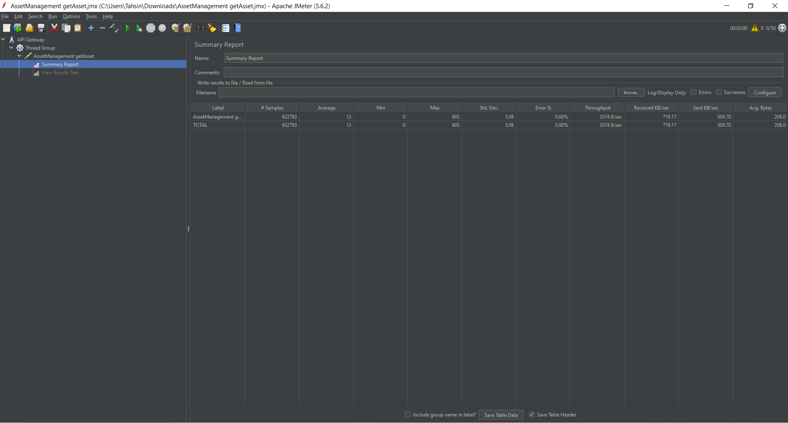

This is the repository for the ByteDance and Tiktok Project for 2023 NUS Orbital

# Table of Contents

1. [About](#about)
2. [Features and Design](#features)
   - [Components](#components)
   - [IDL Management](#idlmanagement)
   - [Server Utility Package](#serverutils)
3. [Data Management](#data)
4. [Getting Started with an example](#gettingstarted)
   1. [Set up Hertz](#step1)
   2. [Set up Consul](#step2)
   3. [Start MongoDB](#step3)
   4. [Setting up kitex](#step4)
   5. [Registering a service](#step5)
   6. [Updating Data](#step6)
   7. [Send requests](#step7)
   8. [Proxy to Ramp Up Performance](#step8)
5. [Performance](#perf)
6. [Limitations](#limit)
7. [What Else?](#misc)

## About <a name="about"></a>

This is the project for our API Gateway based on one scalable Hertz server which serves multiple RPC servers.

The API Gateway has the following endpoints :

- _GET and POST /:serviceName/:path_ - Every service has a registered URL on which its users send requests.

- _GET /ping_ - This endpoint checks the availability of the API gateway. Run it to verify if the server is running or not

- _POST /register_ - Handles admin registration requests

- _PUT /update_ - Server to Update details of Registered services

- _POST /connect_ - Once services are registered, their servers are connected through this endpoint automatically with the help of the server utility package.

- _POST /health_ - This endpoint handles health checks for a service. Services ping to /health to update their health checks.

_Please note that certain details in this project have been "mocked" during development to simplify testing and expedite the process keeping in mind the architecture. However, the API Gateway is designed to be functional, scalable, and modular, ensuring it can accommodate future updates and enhancements seamlessly. Despite the mocked data, the implementation follows best practices and adheres to the intended functionality, allowing for efficient communication between services and robust handling of incoming requests._

PS :
On Windows, Kitex may throw some errors like :

```
[Error] KITEX: OnRead Error: default codec read failed: EOF
default codec read failed: i/o timeout
```

This happens to be due to the Windows environment. On running Kitex servers in Linux, the errors seem to go away.
The issue has been discussed in [here](https://github.com/cloudwego/kitex/issues/932) and [here as well](https://github.com/cloudwego/kitex/issues/964)

<a href="#top">Back to top</a>

## Features and Design <a name="features"></a>



### The project has the following features : <a name="components"></a>

1. API Gateway Server: The API Gateway is implemented as a Hertz server that listens to requests on port 4200. It exposes multiple endpoints in the format `/{serviceName}/{path}` for both POST and GET requests. The API Gateway acts as an intermediary between user requests and the Kitex RPC servers performing load balancing, service discovery, health checks, etc. It accepts incoming HTTP requests and decodes on which service to make a generic RPC call and returns a response.

2. Service Registration and Caching: A user can send in POST requests on `/register` to register their services. The JSON payload includes details about the owner, their services, IDLs, and masked service URLs. This data is stored in MongoDB and is also cached inside the gateway server for quick access. Refer to the <a href="#data">Data</a> section below for the exact info on how data is stored.

3. RPC Protocol Translation: The API Gateway forwards incoming API requests to the Kitex servers using the internal RPC clients within the Hertz server. It enables communication between the client and the respective RPC servers responsible for handling specific services. This is done with their Thrift IDL information sent on registration.

4. Automated Server Connection: The API Gateway provides another package called _server_utils_ to make it easy for Services can automate the registration of their servers to our system by making an HTTP POST request at the `/connect` endpoint of the API Gateway using their registered API key. This enables services to scale up or down dynamically according to their needs.

5. Health Checks: Servers connected to the API Gateway need to declare their health by making periodic requests to the `:/health` endpoint at least every 10 seconds. This ensures that the API Gateway considers the servers healthy and forwards requests to them. This is part of the Server Utility Package and can be easily automated. For this, we have used Consul.

6. Discovery and Load Balancing: The gateway uses Consul's resolver for service discovery and load balancing. It uses Consul’s DNS interface to resolve service names. It can be used to discover services registered with Consul and load balance requests between them. The MVP version of the NewConsulResolver implements round-robin load balancing, distributing the requests equally among the connected RPC servers.

7. Service Registry: Consul has been integrated as the service registry as well. It is completely isolated from the RPC servers. The servers have to, therefore, interact with the Gateway for Consul-related business. This was done to prevent malicious attacks on the service registry. The consul service registry provides a beautiful graphical view of all the connected servers to help admins track, manage and troubleshoot connections. This also allows us more freedom in logic handling for tasks related to the Registry.

- Consul Agent is for Service Registry, Health Checks, Discovery, and Load Balancing. It is hosted on `localhost:8500` for this project. The logic for exact functioning however has been coded manually.

8. Registry Proxy Server: An RPC server that can perform health checks, on behalf of the gateway has been included in the project as well. This RPC server is a special server that has direct access to the Consul Service Registry. When servers ping the `/health` or `/connect` endpoint of the gateway, the gateway can proxy handling this request to this RPC service (if one or more of the Registry Proxy servers are online). This frees up space and resources so that the gateway can handle other requests. This is an optional server that the admin may decide to boot up; if the gateway detects it's offline, then it will perform a health check and connection requests itself.

Note: This service is kept optional because it may be a bottleneck if only a few servers are making requests to the `/health` or `/connect` endpoints. It is advised to boot this service up only when there are many servers connected to the system.

<a href="#top">Back to top</a>

### IDL Management <a name="idlmanagement"></a>

IDL (Interface Definition Language) management plays a crucial role in facilitating communication between the API Gateway and the backend RPC servers using Kitex. Here's how IDLs are managed in the project:

During service registration with POST /register, service owners include their service's IDL details in the JSON payload.

- IDL Mapping and Translation:
  API Gateway stores and uses the IDL contents to translate incoming JSON API requests to Thrift binary format for Kitex.
  The IDLs are also cached for faster API Calls and are used to make and store all the generic clients so that the parsing need to be done again and again. Thrift's compact binary format facilitates efficient communication between the API Gateway and backend RPC servers.

- IDL Versioning and Compatibility:
  The Data Model allows services to keep track of their IDLs and versions. Although one limitation (due to time constraints) is that only the latest IDL version is stored. IDLs can be updated using the `/update` endpoint.

- Synchronization:
  Ensuring IDL information remains consistent and synchronized between components is crucial, which is why IDLs are cached regularly.

  <a href="#top">Back to top</a>

### Server Utility Package <a name="serverutils"></a>

The Server Utility Package provides convenient functions to interact with the API Gateway for automated server registration, health checks, and communication. Importing this package simplifies the process of connecting backend RPC servers to the API Gateway.

1. Importing the Package:

To use the Server Utility Package, import it into your main package or copy-paste the file contents directly into your main package.

2. Example Usage:

The following code snippet demonstrates how to use the Server Utility Package to connect a backend RPC server to the API Gateway and perform health checks:

```

func main() {
  // Other code above

	// Initialize Gateway Client with API key and service name
	gatewayClient := server_utils.NewGatewayClient(configuration.Apikey, configuration.ServiceName)

	// Connect to the API Gateway and get the server ID
	id, err := gatewayClient.ConnectServer(configuration.ServiceURL, advertisedPort)
	if err != nil {
		log.Fatal(err.Error())
	}

	// Perform health checks in a separate goroutine (every 5 seconds)
	go gatewayClient.UpdateHealthLoop(id, 5)

	// Your server's main logic here
}
```

3. Gateway Address Configuration:
   The code snippet provided above assumes that the Gateway Address is set correctly. But since this project is in development, you will have to set the address manually. Info on this is provided right at the beginning of the Server Utils file :

```
const (
	// For Dockerised services on localhost
	// gatewayAddress = "http://host.docker.internal:4200"

	// For services on LocalHost
	gatewayAddress = "http://0.0.0.0:4200"

	// Absolute URL for gatewayAddress can be updated and abstracted in the package
	// during production
)
```

If you are running the service in Docker, locally, set the address to "http://host.docker.internal:4200", and for services on localhost, it can be set to "http://0.0.0.0:4200".

During production, the gatewayAddress should be updated to the absolute URL of the API Gateway and can be abstracted within the package to avoid hardcoding.

<a href="#top">Back to top</a>

## Data <a name="data"></a>

Data is stored in MongoDB for this Project for ease of use and flexibility. The MongoDB client is configured to connect to Mongo at `localhost:27107`

For each unique owner, a document is made in MongoDB, with the following data :

(The API Key is provided by the gateway. Rest is provided by the user.)

```
{
  "ApiKey": "your-api-key", // Appended by the Gateway
  "OwnerName": "John Doe",
  "OwnerId": "user123",
  "Services": [
    {
      "ServiceId": "service1",
      "ServiceName": "Service One",
      "IdlContent": "<Thrift IDL content for Service One>",
      "Version": "1.0.0",
      "ServiceDescription": "This is Service One description.",
      "ServerCount": 3,
      "Paths": [
        {
          "MethodPath": "/method1",
          "ExposedMethod": "GET"
        },
        {
          "MethodPath": "/method2",
          "ExposedMethod": "POST"
        }
      ],
      "RegisteredServers": [
        {
          "ServerUrl": "http://server1.example.com",
          "Port": 8080
        },
        {
          "ServerUrl": "http://server2.example.com",
          "Port": 8080
        },
        {
          "ServerUrl": "http://server3.example.com",
          "Port": 8080
        }
      ]
    },
    {
      "ServiceId": "service2",
      ... and so on
    }
  ]
}
```

The IDL must be provided by stringifying it. A tool like https://jsonformatter.org/json-stringify-online can be used for this.

A user can register multiple services, and multiple registered servers for their services and along with some flexibility in exposed URLs, the method is masked with Path field.

_For ease of testing, regardless of how many Registered Servers are there, we can connect more, and with different ServerURLs. "Mocking" the authentication of RPC servers this way will save time on testing._

<a href="#top">Back to top</a>

## Getting Started with an example <a name="gettingstarted"></a>

#### 1. Build and run the Hertz server <a name="step1"></a>

Run `go build; go run .` to build and run the API Gateway server.

To check if the server is running, hit the following GET endpoint
`"http://0.0.0.0:4200/ping"`

It should reply with the message :

```
{
    "message": "pong"
}
```

<a href="#top">Back to top</a>

#### 2. Start Consul <a name="step2"></a>

Assuming Consul is already installed, run `consul agent -dev`. This will start Consul on `localhost:8500` with a beautiful GUI of all Services connected.


<a href="#top">Back to top</a>

#### 3. Start MongoDB <a name="step3"></a>

Start MongoDB server on `localhost:27017`

<a href="#top">Back to top</a>

#### 4. Setup up Kitex with the Server utility package as mentioned above. <a name="step4"></a>

Here's an example of setting up a Kitex server with Docker :

```
  config, err := LoadConfiguration("serviceConfig.json")
	if err != nil {
		log.Fatal(err)
	}

  gatewayClient := NewGatewayClient(config.Apikey, config.ServiceName)
	advertisedPort := os.Getenv("PORT")

	advertisedPort = GetFreePort()

	id, err := gatewayClient.connectServer(config.ServiceURL, advertisedPort)
    if err != nil {
    log.Fatal(err.Error())
	}

	go gatewayClient.updateHealthLoop(id, 5)

	url := config.URL
	port := config.Port
	addrDocker, _ := net.ResolveTCPAddr("tcp", url+":"+port)

	svr := asset_management.NewServer(new(AssetManagementImpl),
	server.WithServiceAddr(addrDocker),
  server.WithLimit(&limit.Option{MaxConnections: 100000, MaxQPS: 100000}),
	server.WithReadWriteTimeout(100*time.Second))

	kitexerr := svr.Run()

	if kitexerr != nil {
	log.Println(kitexerr.Error())
	}
```

And on LocalHost :

```
  config, err := LoadConfiguration("serviceConfig.json")
    if err != nil {
      log.Fatal(err)
    }

  var addr = getAddr() // Function in utils.go

	gatewayClient := NewGatewayClient(config.Apikey, config.ServiceName)

	id, err := gatewayClient.connectServer(addr.IP.String(), strconv.Itoa(addr.Port))
	if err != nil {
		log.Fatal(err.Error())
	}

	go gatewayClient.updateHealthLoop(id, 5)

	svr := asset_management.NewServer(new(AssetManagementImpl),
		server.WithServiceAddr(addr),
		server.WithLimit(&limit.Option{MaxConnections: 100000, MaxQPS: 100000}),
		server.WithReadWriteTimeout(100*time.Second))

	kitexerr := svr.Run()

	if kitexerr != nil {
		log.Println(kitexerr.Error())
	}
```

<a href="#top">Back to top</a>

#### 5. Register a service <a name="step5"></a>

Send a post request to `0.0.0.0:4200`. Let's say we want to register the Asset Service (in the rpc_services) folder. Therefore we'd send a request with the following JSON :

```
[
    {
      "OwnerName": "John Doe",
      "OwnerId": "UserName",
      "Services": [
        {
          "ServiceId": "1",
          "ServiceName": "AssetManagement",
          "IdlContent": "namespace Go asset.management\n\nstruct QueryAssetRequest {\n    1: string ID;\n}\n\nstruct QueryAssetResponse {\n    1: bool   Exist;\n    2: string ID;\n    3: string Name;\n    4: string Market;\n}\n\nstruct InsertAssetRequest {\n    1: string ID;\n    2: string Name;\n    3: string Market;\n}\n\nstruct InsertAssetResponse {\n    1: bool Ok;\n    2: string Msg;\n}\n\nservice AssetManagement {\n    QueryAssetResponse queryAsset(1: QueryAssetRequest req);\n    InsertAssetResponse insertAsset(1: InsertAssetRequest req);\n}\n",
          "Version": "1.0",
          "ServiceDescription": "Service Description",
          "ServerCount": 2,
          "Paths": [
            {
              "ExposedMethod": "insertAsset",
              "MethodPath": "newAsset"
            },
            {
              "ExposedMethod": "queryAsset",
              "MethodPath": "getAsset"
            }
          ],
          "RegisteredServers": [
            {
              "ServerUrl": "http://localhost:8000",
              "Port": 8000
            },
            {
              "ServerUrl": "http://localhost:8001",
              "Port": 8001
            }
          ]
        }
      ]
    }
]
```

Note:

The above service would have the following public endpoints registered on the gateway:

- (POST) `/AssetManagement/newAsset` which maps to the private "insertAsset" endpoint of the service
- (GET) `/AssetManagement/getAsset` which maps to the private "queryAsset" endpoint of the service

A response with the API Key and Status will be recieved.

<a href="#top">Back to top</a>

#### 6. Sending requests <a name="step6"></a>

Send a POST or GET requests to the "/{serviceName}/{path}", in this case `http://localhost:4200/AssetManagement/newAsset` endpoint, for example:

```
curl -X POST -H "Content-Type: application/json"
-d '{
  "ID": "2",
  "Name": "Google",
  "Market": "US"
}'
"http://localhost:4200/AssetManagement/newAsset"
```

Now try quering the info,

```
curl -X GET http://localhost:4200/AssetManagement/getAsset?ID=2
```

<a href="#top">Back to top</a>

#### 7. Update your service <a name="step7"></a>

This step can actually be done anytime after registration but placing it here made sense.

For updating, put in the api key received on registration. OR, for easier testing we made the provision that if a service tries to updated using a master key the update will still be authorised. Further add the correct owner ID in the parameters. So the request URL should look something like this :

`http://localhost:4200/update?ownerid=UserName`

The master api key is "master_api_key_uuid" without the quotes.

_The Master Key is just a temporary provision made for easy testing and WILL be removed in the future. Managing API keys can be quite a hassle._

Try updating with the new request body :

```
[
    {
      "OwnerName": "John Doe Updated",
      "OwnerId": "UserName",
      "Services": [
        {
          "ServiceId": "1",
          "ServiceName": "AssetManagement",
          "IdlContent": " ",
          "Version": "5.0",
          "ServiceDescription": "Service Description Updated",
          "ServerCount": 2,
          "Paths": [
            {
              "ExposedMethod": "insertAsset",
              "MethodPath": "newAsset"
            },
            {
              "ExposedMethod": "queryAsset",
              "MethodPath": "getAsset"
            }
          ],
          "RegisteredServers": [
            {
              "ServerUrl": "http://localhost:8000",
              "Port": 8000
            },
            {
              "ServerUrl": "http://localhost:8001",
              "Port": 8001
            }
          ]
        }
      ]
    }
]
```

With the above updated blank IDL, we try sending a request now, and but it will not be authorised by the gateway.

In MongoDB we can notice the updated changes.

A provision for getting back information for an Admin has not yet been implemented due to time constraints of the project. But it would certainly be a great feature to have.

<a href="#top">Back to top</a>

#### 8. Setup Registry Proxy Server(s) **[Optional]** <a name="step8"></a>

If the server load is getting too high and many rpc servers are connected, you may decide to connect a special RPC server we made, the Registry Proxy Service. The purpose of this special RPC server is to allow the gateway to proxy all the health check requests/server connection requests from different servers so that the gatway can have resources to handle more service requests. By adding this server, we were able to ramp up performance from ~_2600 req/s_ to ~_3000 req/s_ for 50 users and 3 rpc servers.

You may setup this server by:

1. Register this service in the gateway. You may do so by sending a `POST` request to `/register` endpoint as such:

```
[
    {
        "OwnerName": "XXXXX",
        "OwnerId": "XXXXX",
        "Services": [
            {
                "ServiceId": "X",
                "ServiceName": "RegistryProxy",
                "IdlContent": "namespace Go registy.proxy\n\nstruct ConnectRequest {\n    1: string ApiKey;\n    2: string ServiceName\n    3: string ServerAddress\n    4: string ServerPort\n}\n\nstruct ConnectResponse {\n    1: string Status;\n    2: string Message;\n    3: string ServerID;\n}\n\nstruct HealtRequest {\n    1: string ApiKey;\n    2: string ServerID;\n}\n\nstruct HealthResponse {\n    1: string Status;\n    2: string Message;\n}\n\nservice RegistryProxy {\n    ConnectResponse connectServer(1: ConnectRequest req);\n    HealthResponse healthCheckServer(1: HealtRequest req);\n}\n",
                "Version": "1.0",
                "ServiceDescription": "Service for proxying health checks and coneection requests",
                "ServerCount": 0,
                "Paths": [
                    {
                        "ExposedMethod": "healthCheckServer",
                        "MethodPath": "healthCheckServer"
                    },
                    {
                        "ExposedMethod": "connectServer",
                        "MethodPath": "connectServer"
                    }
                ],
                "RegisteredServers": [
                ]
            }
        ]
    }
]
```

2. Booting up and instance of registry proxy from the rpc_services provided by running `go run .` in the /rpc_services/registry_proxy_service directory.

Shortly after the server is booted up, the gateway will detect the server and start to proxy health check requests and server connection requests to this registry proxy server, freeing up more resources for the gateway to handle other requests.

<a href="#top">Back to top</a>

## Performance <a name="perf"></a>

#### Current Performance <a name="currentperf"></a>

On Load testing with Apache JMeter, we were abe to get the following benchmarks


3 instances of AssetManagement, 1 registry proxy server (for proxied health checks)

- Users : 50
- Total time: 3 mins
- Ramp up time : 1sec

#### MVP Performance : <a name="mvpperf"></a>

On Load testing with Postman, we were able to have the following benchmarks:
The lower the blue line is, the better.
The red line indicates error rate.


2 instances of User Service and 3 instances of Asset Management Service

- Users : 25
- Total time : 5 mins
- Ramp up time: 1 min


2 instances of User Service and 3 instances of Asset Management Service

- Users : 50
- Total time : 5 mins
- Ramp up time: 1 min

Despite the spike in between the server showed great recovery.


3 instances of User Service and 3 instances of Asset Management Service

- Users : 30
- Total time : 5 mins
- Ramp up time: 1 min

Again, after the spike, the gateway showed great recovery.

<a href="#top">Back to top</a>

## Limitations <a name="limit"></a>

On thorough testing we found some limitations such as :

- Kitex Servers cannot reconnect if the Gateway server goes down, even for a second. The server_utility package needs to be updated for this.
- While the Gateway is designed to be Scalable, the only non-scalable aspect as of now is the Data Management with the Database and service registry.

<a href="#top">Back to top</a>

## What Else? <a name="misc"></a>

- Nothing for now :p

<a href="#top">Back to top</a>
